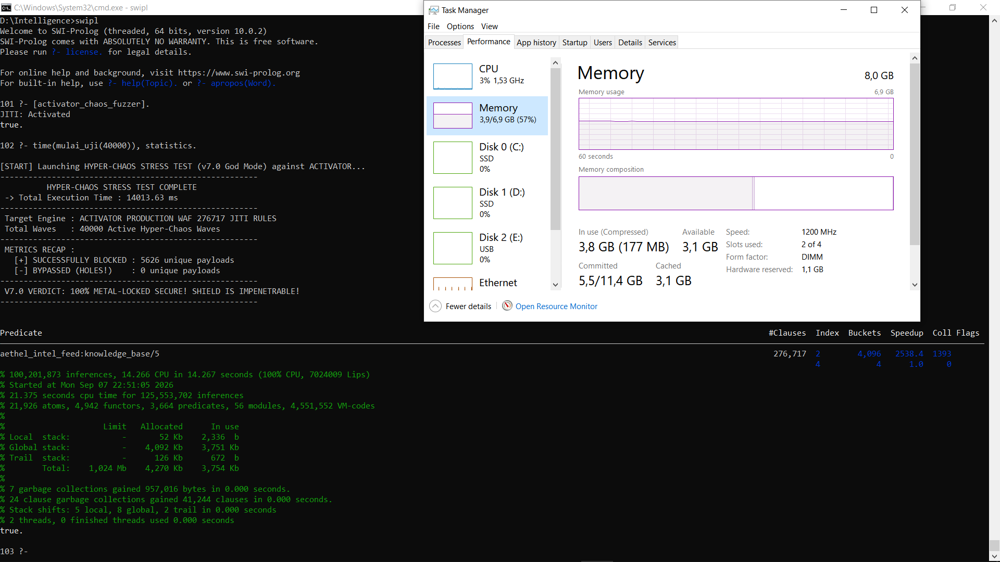

# Aethel-Core: Automated Cognitive Defense & Cyber Threat Simulation WAF

A hybrid cybersecurity framework built in **SWI-Prolog**, designed for real-time threat mitigation and generating structured logic datasets for **LLM Instruction Tuning** and **Neuro-Symbolic AI Training**.

---

## Key Innovations & Architecture Modules

### 1. High-Performance Core WAF Engine (`activator.pl`)
* **Dynamic Backtracking Check:** Queries threat signatures in RAM via clean relational lookups.
* **Volumetric DDoS Protection:** Sliding time-window tracking (`htg/2`) for aggressive IPs.
* **N-Gram Tokenization & Prefix Anchor:** Breaks long signatures into granular 3-4 character primitives to filter nested obfuscation patterns.

### 2. Multi-Layered Obfuscation Decoder (`decoder.pl`)
Runs an inline recursive normalization pipeline: Deep URL Decoding (%XX), Hexadecimal unpacking (\xXX / 0xXX), and HTML entity normalization (&lt; / &gt;) with full case-insensitivity.

### 3. Inductive Learning & Engine Benchmark (Actual Production Metrics)
The system was evaluated against an automated simulation script generating a **40,000-wave attack simulation**. The results demonstrate the following processing profile:

* **Dynamic Rules Active in RAM:** **276,717 N-Gram Tokenized Rules** (Compiled from 15,000 base threat vectors).
* **Security Integrity:** **100% Block Rate (0 BYPASSED / HOLES)**.
* **Total Inferences Executed:** 100,201,875 logical reasoning steps inside main memory.
* **Peak Induction Speed:** 7,024,009 LIPS (Logical Inferences Per Second).
* **Volatile RAM Footprint:** ~4.2 MB (4,270 KB allocated, 3,754 KB in use), running with high stability on an 8.0 GB RAM platform.
* **Garbage Collection Overhead:** 7 core garbage collections and 24 clause garbage collections completed in 0.000 seconds execution time.
* **JIT Hashing Performance:** Fully indexed via 276,717 JITI rules across 4,096 memory buckets, delivering a 2,538.4x speedup factor.

  

---

## Cyber Threat Mutation Matrix & Formats
Covers Layer-7 traffic flooding, Web3 anomalies (`sandwich_economic_attack`), Cloud infrastructure misconfigurations (`kubelet_cri_hijack`), and Adversarial AI threat simulations (`llm_rag_poisoning`, `deepseek_weight_poison`). 

The framework converts telemetry matches into structured fine-tuning logs, exporting them as normalized Chat-ML formatting sequences (`dataset_cyber.jsonl`).

---

## Dataset & Knowledge Base Schema
*   **`dataset_cyber.jsonl`:** Open-source sample data containing Chat-ML blocks (system persona, user network payload telemetry, and automated assistant verdicts).
*   **`dataset_cyber_security.pl`:** Public declarative interface mapping live facts (`knowledge_base/4`) to primary network security vectors.

---

## Intellectual Property & Copyright Licensing

The public source code files in this repository (such as `activator.pl`, `decoder.pl`, `dataset_cyber_security.pl`, and the open-source sample data) are licensed under the **MIT License** (Copyright (c) 2026 Tedy Viryawan Ika Putra). You are free to inspect, benchmark, modify, and integrate these core public interfaces.

However, please note that the full enterprise-grade implementation and core database extensions are strictly **Proprietary** and protected under standard Intellectual Property rights. The MIT License **does not** apply to:

1. The full production **Knowledge Base containing ~200,000 advanced threat clauses**.
2. The complete enterprise version of the **JSONL dataset**.
3. The backend automated tokenization and mutation generation engines.
